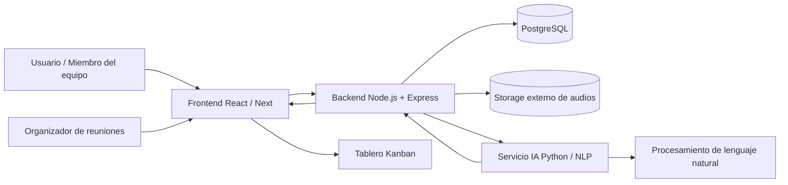
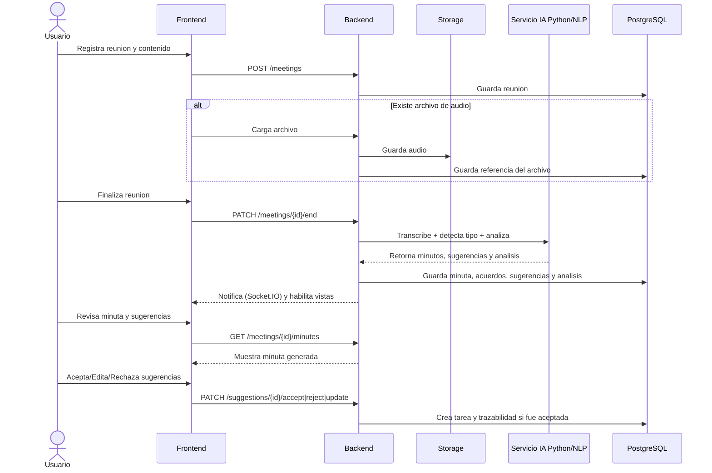
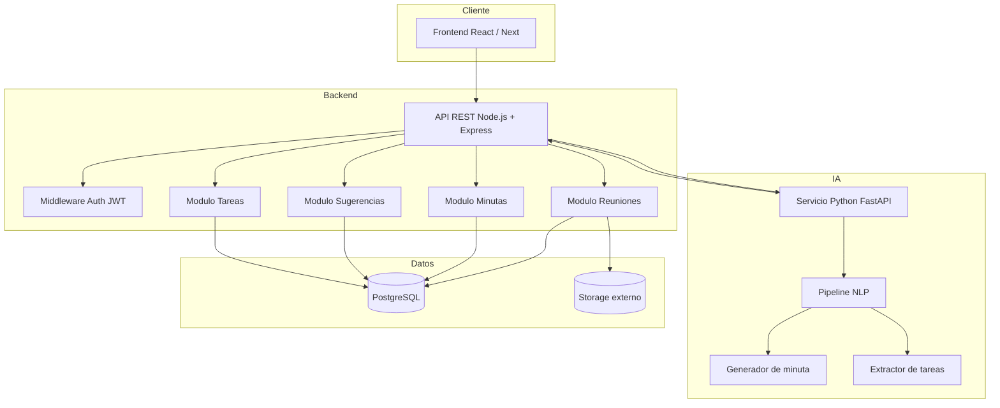
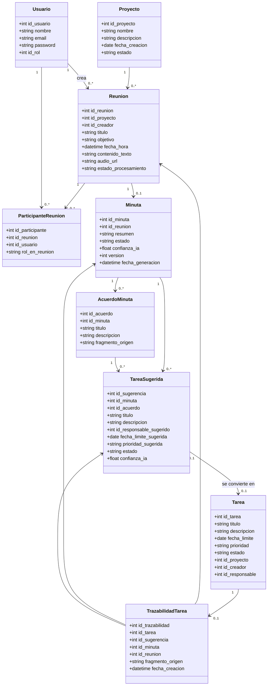
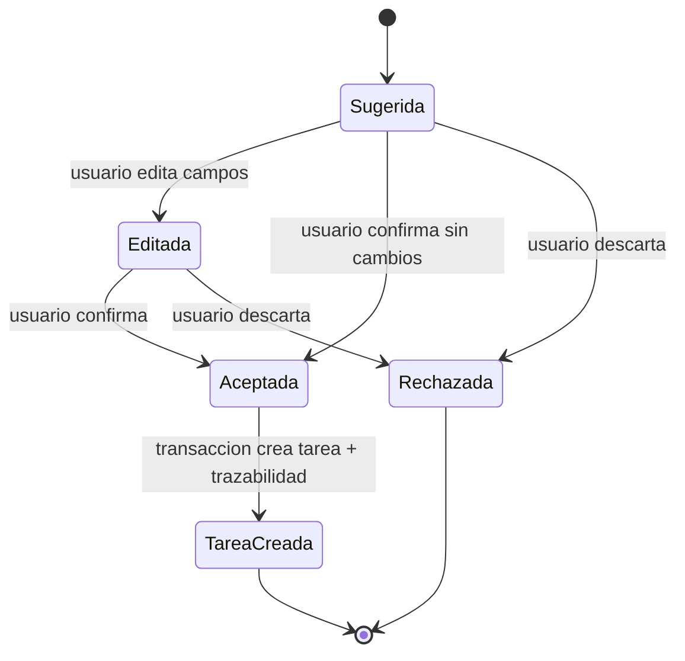

# Sprint 2

## Sprint Planning

**Proyecto:** Software de Gestion Agil: Automatizacion de Tareas y Minutas mediante Inteligencia Artificial para la Colaboracion de Equipos en Tiempo Real  
**Sprint numero:** 2  
**Tiempo programado:** 3 semanas  
**Fecha de inicio:** 06/05/2026  
**Fecha de finalizacion:** 26/05/2026  
**Objetivo clave del Sprint:** Automatizacion de minutas con IA e integracion del backend inteligente.

### Historias de usuario candidatas seleccionadas

| HU | Nombre corto | Prioridad | Enfoque tecnico |
|---|---|---:|---|
| HU-5 | Registro de Reuniones | Alta | Persistencia y gestion estructurada de reuniones |
| HU-6 | Generacion de Minutas con IA | Alta | Procesamiento NLP, generacion y validacion de minutas |
| HU-07 | Sugerencia automatica de tareas desde minutas | Alta | Extraccion de acciones, responsables, fechas y prioridades |
| HU-08 | Validacion de tarjetas sugeridas por IA | Alta | Flujo humano-en-el-ciclo para aceptar, editar o rechazar sugerencias |
| HU-13 | Trazabilidad entre minuta y tarea | Media | Relacion tecnica entre acuerdo, minuta, sugerencia y tarea final |

### Resultado esperado del incremento

Al finalizar el Sprint 2, el sistema debera permitir registrar reuniones, procesar texto o audio mediante un servicio de IA, generar minutas estructuradas, identificar tareas sugeridas desde los acuerdos detectados y permitir que el usuario valide dichas sugerencias antes de convertirlas en tareas definitivas del tablero Kanban. Cada tarea generada desde una minuta debera conservar trazabilidad hacia la reunion y el punto que la origino.

### Definition of Done del Sprint 2

Una historia de usuario sera considerada terminada cuando cumpla los siguientes criterios:

- La funcionalidad esta implementada en frontend, backend y base de datos cuando corresponda.
- Los endpoints REST estan protegidos con autenticacion y validacion de pertenencia al proyecto.
- El servicio de IA puede recibir texto o transcripcion y retornar una minuta estructurada.
- Las tareas sugeridas por IA no se guardan como tareas definitivas hasta que el usuario las acepte.
- Las tareas aceptadas mantienen referencia a la minuta, reunion y fragmento origen.
- Las migraciones de base de datos estan ejecutadas en entorno de prueba.
- Existen pruebas unitarias para backend, frontend y servicio IA.
- Existen pruebas de integracion para el flujo reunion -> minuta -> sugerencias -> tarea.
- Los endpoints principales estan documentados en Swagger o documento tecnico equivalente.
- El incremento fue validado por el Product Owner con base en los criterios de aceptacion.

---

## Objetivos del sprint

El objetivo del Sprint 2 es construir el nucleo inteligente del sistema, integrando el flujo de gestion de reuniones con un servicio de inteligencia artificial capaz de procesar informacion textual o transcrita para generar minutas y tareas sugeridas.

Desde un enfoque de ingenieria de software, este sprint se orienta a resolver tres aspectos principales:

1. **Captura y persistencia estructurada de reuniones:** registrar reuniones con participantes, fecha, objetivo, contenido textual o archivo asociado.
2. **Automatizacion mediante IA:** procesar la informacion de la reunion para generar una minuta organizada, extraer acuerdos y sugerir tareas accionables.
3. **Control humano y trazabilidad:** permitir que el usuario valide las sugerencias antes de crear tareas definitivas, manteniendo trazabilidad desde la tarea hasta el acuerdo original.

### Entregables principales

| Entregable | Descripcion |
|---|---|
| Modulo de reuniones | Registro, edicion, consulta y almacenamiento de reuniones por proyecto |
| Servicio IA Python/NLP | Servicio separado para generar minutas y extraer tareas desde texto o transcripcion |
| API de integracion IA | Endpoints del backend para orquestar solicitudes hacia el servicio inteligente |
| Modulo de minutas | Generacion, edicion, validacion y almacenamiento de minutas |
| Modulo de sugerencias | Generacion de tareas sugeridas desde acuerdos detectados |
| Validacion de sugerencias | Interfaz para aceptar, rechazar o editar tarjetas sugeridas por IA |
| Trazabilidad | Relacion entre reunion, minuta, punto tratado, sugerencia y tarea final |
| Pruebas | Pruebas unitarias, integracion y QA del flujo completo |

---

## Historias Usuarios

### HU-5 - Registro de Reuniones

| Campo | Detalle |
|---|---|
| **Id** | HU-5 |
| **Nombre corto** | Registro de Reuniones |
| **Prioridad** | Alta |
| **PHU** | 5 |
| **Estado** | Elaborado |
| **Como** | Usuario |
| **Quiero** | Registrar los datos y temas de las reuniones |
| **Para** | Generar un historial estructurado de los encuentros del equipo |
| **Desarrollador responsable** | Alex Ticlla Choque / Alvaro Sonco Guzman |

#### Criterios de aceptacion

- El sistema debe permitir crear una reunion asociada a un proyecto o espacio de trabajo.
- El sistema debe registrar titulo, objetivo, fecha, hora, participantes y descripcion de la reunion.
- El sistema debe permitir almacenar contenido textual, notas o transcripcion preliminar de la reunion.
- El sistema debe permitir cargar una referencia a archivo de audio cuando aplique.
- El sistema debe mostrar el historial de reuniones por proyecto.
- El sistema debe permitir editar datos de la reunion antes de generar la minuta.
- El sistema debe restringir el acceso a reuniones segun el proyecto y rol del usuario.

#### Reglas tecnicas

- Una reunion debe pertenecer obligatoriamente a un proyecto.
- Una reunion puede tener varios participantes.
- Una reunion puede tener cero o una minuta generada inicialmente.
- El contenido de la reunion debe almacenarse de forma segura y versionable.
- Si se carga audio, el archivo se almacena en AWS S3 privado cuando esta configurado; la base de datos guarda solo la referencia `s3://bucket/key`. En desarrollo puede usarse almacenamiento local como fallback.

---

### HU-6 - Generacion de Minutas con IA

| Campo | Detalle |
|---|---|
| **Id** | HU-6 |
| **Nombre corto** | Generacion de Minutas con IA |
| **Prioridad** | Alta |
| **PHU** | 13 |
| **Estado** | Elaborado |
| **Como** | Organizador |
| **Quiero** | Que la IA redacte automaticamente la minuta a partir del audio o texto de la reunion |
| **Para** | Reducir el tiempo dedicado a tareas administrativas post-reunion |
| **Desarrollador responsable** | Alex Ticlla Choque / Alvaro Sonco Guzman |

#### Criterios de aceptacion

- El sistema debe permitir generar una minuta a partir del texto registrado en una reunion.
- El sistema debe permitir procesar una transcripcion proveniente de audio cuando exista.
- La minuta generada debe contener secciones como resumen, temas tratados, acuerdos, decisiones y proximos pasos.
- El usuario debe poder revisar, editar y validar la minuta antes de marcarla como aprobada.
- La minuta debe quedar almacenada y asociada a la reunion correspondiente.
- El sistema debe registrar el estado de procesamiento: pendiente, procesando, generado, validado o error.
- El sistema debe manejar errores cuando el texto sea insuficiente, el audio sea invalido o el servicio IA no responda.

#### Reglas tecnicas

- El backend Node.js no debe contener la logica NLP principal; debe delegarla al servicio IA.
- El servicio IA debe retornar una respuesta estructurada en formato JSON.
- La minuta debe guardar el texto generado y los metadatos de procesamiento.
- Se debe registrar fecha de generacion, usuario solicitante y version de la minuta.

#### Contrato actual del servicio IA (minutas)

```json
{
    "transcript": "Texto o transcripcion de la reunion",
    "meeting_title": "Sprint Planning 2",
    "participants": ["Ana", "Luis"],
    "language": "es"
}
```

Respuesta esperada:

```json
{
    "summary": "Resumen ejecutivo de la reunion",
    "key_points": ["Punto clave 1", "Punto clave 2"],
    "agreements": [
        {
            "order": 1,
            "text": "Acuerdo identificado"
        }
    ]
}
```

---

### HU-07 - Sugerencia automatica de tareas desde minutas

| Campo | Detalle |
|---|---|
| **Id** | HU-07 |
| **Nombre corto** | Sugerencia automatica de tareas desde minutas |
| **Prioridad** | Alta |
| **PHU** | 8 |
| **Estado** | Elaborado |
| **Como** | Miembro del equipo |
| **Quiero** | Que el sistema analice la minuta generada a partir del audio o texto de la reunion |
| **Para** | Identificar posibles tareas, responsables, fechas limite y prioridades que puedan convertirse en tarjetas del tablero Kanban |
| **Desarrollador responsable** | Alex Ticlla Choque / Alvaro Sonco Guzman |

#### Criterios de aceptacion

- El sistema debe analizar la minuta validada o generada para identificar posibles tareas.
- Cada tarea sugerida debe contener titulo, descripcion, responsable sugerido, fecha limite sugerida y prioridad sugerida cuando sea posible.
- El sistema debe marcar las tareas generadas como sugerencias y no como tareas definitivas.
- Cada sugerencia debe conservar el fragmento de texto que la origino.
- El sistema debe asignar un nivel de confianza a cada sugerencia.
- El sistema debe permitir consultar las sugerencias asociadas a una minuta.
- El sistema debe evitar duplicar sugerencias ya generadas para la misma minuta.

#### Reglas tecnicas

- Las sugerencias deben guardarse en una tabla independiente de la tabla `tarea`.
- Una sugerencia solo se convierte en tarea cuando el usuario la acepta.
- Si la IA no detecta responsable o fecha limite, la sugerencia debe quedar incompleta pero editable.
- La extraccion debe poder ejecutarse nuevamente, manteniendo control de versiones o reemplazo controlado.

---

### HU-08 - Validacion de tarjetas sugeridas por IA

| Campo | Detalle |
|---|---|
| **Id** | HU-08 |
| **Nombre corto** | Validacion de tarjetas sugeridas por IA |
| **Prioridad** | Alta |
| **PHU** | 5 |
| **Estado** | Elaborado |
| **Como** | Miembro del equipo |
| **Quiero** | Que las tareas sugeridas por la IA aparezcan en el tablero como tarjetas traslucidas o temporales |
| **Para** | Poder aceptarlas, rechazarlas o editarlas antes de convertirlas en tareas definitivas |
| **Desarrollador responsable** | Alex Ticlla Choque / Alvaro Sonco Guzman |

#### Criterios de aceptacion

- El sistema debe mostrar las tareas sugeridas como tarjetas temporales o visualmente diferenciadas.
- El usuario debe poder aceptar una sugerencia y convertirla en tarea definitiva.
- El usuario debe poder rechazar una sugerencia para evitar su creacion como tarea.
- El usuario debe poder editar titulo, descripcion, responsable, fecha limite y prioridad antes de aceptar.
- Una tarea aceptada debe aparecer en la columna correspondiente del tablero Kanban.
- Una sugerencia rechazada no debe crear registros en la tabla de tareas definitivas.
- El sistema debe registrar quien acepto, edito o rechazo la sugerencia.

#### Reglas tecnicas

- El estado de una sugerencia puede ser: `sugerida`, `editada`, `aceptada` o `rechazada`.
- La aceptacion debe ejecutarse en una transaccion que cree la tarea y actualice el estado de la sugerencia.
- La interfaz debe evitar doble aceptacion de una misma sugerencia.
- La trazabilidad debe generarse automaticamente al aceptar la sugerencia.

---

### HU-13 - Trazabilidad entre minuta y tarea

| Campo | Detalle |
|---|---|
| **Id** | HU-13 |
| **Nombre corto** | Trazabilidad entre minuta y tarea |
| **Prioridad** | Media |
| **PHU** | 5 |
| **Estado** | Elaborado |
| **Como** | Usuario |
| **Quiero** | Que cada tarea generada desde una minuta mantenga una referencia al punto de reunion que la origino |
| **Para** | Consultar el contexto del acuerdo y mejorar el seguimiento del trabajo |
| **Desarrollador responsable** | Alex Ticlla Choque / Alvaro Sonco Guzman |

#### Criterios de aceptacion

- Toda tarea creada desde una sugerencia de IA debe mantener referencia a la minuta origen.
- La tarea debe permitir consultar el fragmento o acuerdo que origino su creacion.
- La tarea debe mostrar la reunion relacionada cuando el usuario revise el detalle.
- El sistema debe conservar la relacion aunque la minuta sea editada posteriormente.
- El sistema debe permitir auditar que usuario acepto la sugerencia y en que fecha.
- El sistema debe impedir eliminar la trazabilidad si la tarea fue generada desde minuta.

#### Reglas tecnicas

- La trazabilidad debe implementarse mediante una tabla relacional entre tarea, sugerencia, minuta y reunion.
- El sistema debe almacenar el fragmento origen como evidencia textual para evitar perdida de contexto.
- La trazabilidad debe considerarse parte del modelo de auditoria del sistema.

---

## Contexto del Sistema

Durante el Sprint 2, el sistema evoluciona desde un tablero de gestion de tareas hacia una plataforma con procesamiento inteligente de reuniones. El usuario registra una reunion, el backend almacena la informacion, el servicio IA procesa el contenido y el sistema genera minutas y sugerencias de tareas. Posteriormente, el usuario valida las sugerencias antes de enviarlas al tablero Kanban.

### Actores principales

| Actor | Responsabilidad dentro del Sprint 2 |
|---|---|
| Usuario | Consulta reuniones, minutas y tareas generadas |
| Miembro del equipo | Revisa sugerencias, edita y acepta tareas propuestas |
| Organizador de reuniones | Registra reuniones y solicita generacion de minutas |
| Product Owner | Valida que las historias cumplan los criterios de aceptacion |
| Motor de IA | Procesa texto o audio transcrito para generar minutas y sugerencias |
| Servicio de almacenamiento | Guarda archivos pesados como audios o documentos |

### Diagrama de contexto



### Flujo funcional del Sprint 2



---

## Sprint Backlog

**Objetivo del Sprint:** Implementar el flujo inteligente de reuniones, generacion automatica de minutas, extraccion de tareas sugeridas y trazabilidad hacia tareas definitivas del tablero Kanban.

| Id | Tarea | HU relacionada | Estimacion | Responsable | Estado |
|---|---|---|---:|---|---|
| SP2-01 | Refinar criterios de aceptacion y contratos tecnicos del Sprint 2 | HU-5, HU-6, HU-07, HU-08, HU-13 | 4 hrs | Alex Ticlla | Completado |
| SP2-02 | Disenar modelo de datos para reuniones, minutas, sugerencias y trazabilidad | HU-5, HU-6, HU-13 | 6 hrs | Alvaro Sonco | Completado |
| SP2-03 | Crear migraciones PostgreSQL para nuevas entidades | HU-5, HU-6, HU-07, HU-13 | 5 hrs | Alex Ticlla | Completado |
| SP2-04 | Implementar API REST para registro y consulta de reuniones | HU-5 | 8 hrs | Alvaro Sonco | Completado |
| SP2-05 | Implementar interfaz de registro de reunion y carga de contenido | HU-5 | 8 hrs | Alex Ticlla | Completado |
| SP2-06 | Crear servicio IA base en Python para procesamiento NLP | HU-6, HU-07 | 8 hrs | Alvaro Sonco | Completado |
| SP2-07 | Implementar adaptador de transcripcion o procesamiento de texto | HU-6 | 8 hrs | Alex Ticlla | Completado |
| SP2-08 | Implementar generacion de minuta estructurada | HU-6 | 10 hrs | Alvaro Sonco | Completado |
| SP2-09 | Integrar backend Node.js con servicio IA mediante API interna | HU-6, HU-07 | 8 hrs | Alex Ticlla | Completado |
| SP2-10 | Implementar persistencia de minutas, acuerdos y estados de procesamiento | HU-6 | 6 hrs | Alvaro Sonco | Completado |
| SP2-11 | Implementar extraccion de tareas sugeridas desde minuta | HU-07 | 10 hrs | Alex Ticlla | Completado |
| SP2-12 | Implementar reglas para responsable, fecha limite, prioridad y confianza | HU-07 | 6 hrs | Alvaro Sonco | Completado |
| SP2-13 | Disenar tarjetas temporales o traslucidas en frontend | HU-08 | 6 hrs | Alex Ticlla | Completado |
| SP2-14 | Implementar aceptar, rechazar y editar sugerencias | HU-08 | 8 hrs | Alvaro Sonco | Completado |
| SP2-15 | Crear tarea definitiva a partir de sugerencia aceptada | HU-08, HU-13 | 8 hrs | Alex Ticlla | Completado |
| SP2-16 | Implementar trazabilidad tarea-minuta-reunion-fragmento origen | HU-13 | 6 hrs | Alvaro Sonco | Completado |
| SP2-17 | Implementar manejo de errores, logs y auditoria basica | HU-6, HU-07, HU-08 | 5 hrs | Alex Ticlla | En progreso |
| SP2-18 | Ejecutar pruebas unitarias de backend y servicio IA | Todas | 8 hrs | Alvaro Sonco | Pendiente |
| SP2-19 | Ejecutar pruebas de integracion del flujo completo | Todas | 8 hrs | Alex Ticlla / Alvaro Sonco | Pendiente |
| SP2-20 | Documentar endpoints, contratos JSON y procedimiento de pruebas | Todas | 4 hrs | Alex Ticlla | Completado |

**Total estimado:** 140 horas

---

## Flujo de Diseno

### 1. Diseno de arquitectura

El Sprint 2 utiliza una arquitectura modular con separacion explicita entre el backend principal y el servicio de inteligencia artificial. Esta separacion permite mantener la logica de negocio en Node.js y aislar el procesamiento NLP en Python, facilitando pruebas, mantenimiento y escalabilidad.



### 2. Componentes tecnicos

| Componente | Tecnologia | Responsabilidad |
|---|---|---|
| Frontend | React / Next | Registrar reuniones, mostrar minutas y validar sugerencias |
| Backend API | Node.js + Express | Orquestar reglas de negocio, seguridad, persistencia e integracion IA |
| Servicio IA | Python + FastAPI | Procesar texto/transcripcion, generar minutas y extraer tareas |
| Base de datos | PostgreSQL | Guardar reuniones, minutas, sugerencias, tareas y trazabilidad |
| Storage externo | AWS S3 privado con fallback local | Guardar audios o documentos pesados sin persistir binarios en PostgreSQL |
| Autenticacion | JWT | Proteger endpoints y validar usuario autenticado |

#### Configuracion de storage de audio

El backend Node usa S3 cuando existen `AWS_REGION` y `AWS_S3_BUCKET` en `task_manager_back/.env`. Si esas variables no estan configuradas, mantiene el fallback local en `AUDIO_UPLOAD_DIR`.

```env
AUDIO_UPLOAD_DIR=./public/uploads/audio
AWS_REGION=us-east-1
AWS_S3_BUCKET=gestionagil-331145994790-us-east-1-an
AWS_S3_AUDIO_PREFIX=meetings/audio
AWS_ACCESS_KEY_ID=...
AWS_SECRET_ACCESS_KEY=...
```

El formato de los objetos en S3 es `meetings/audio/{meetingId}-{suffix}.{extension}` y el campo `Meeting.audioUrl` guarda `s3://{bucket}/{key}`. Los objetos son privados; en esta fase no se generan URLs publicas ni URLs firmadas.

### 3. Endpoints principales

| Metodo | Endpoint | Descripcion |
|---|---|---|
| POST | `/api/v1/projects/{projectId}/meetings` | Crear una reunion |
| GET | `/api/v1/projects/{projectId}/meetings` | Listar reuniones por proyecto |
| GET | `/api/v1/meetings` | Listar reuniones del usuario (todos los proyectos) |
| GET | `/api/v1/meetings/{meetingId}` | Consultar detalle de una reunion |
| PATCH | `/api/v1/meetings/{meetingId}/start` | Marcar reunion como en curso |
| POST | `/api/v1/meetings/{meetingId}/audio` | Subir audio de la reunion |
| PATCH | `/api/v1/meetings/{meetingId}/end` | Finalizar reunion y disparar pipeline IA |
| GET | `/api/v1/meetings/{meetingId}/minutes` | Consultar minuta generada |
| GET | `/api/v1/meetings/{meetingId}/daily` | Consultar analisis Daily Scrum |
| GET | `/api/v1/meetings/{meetingId}/kanban-updates` | Consultar actualizaciones de Kanban |
| GET | `/api/v1/minutes/{minuteId}` | Consultar minuta por ID |
| GET | `/api/v1/minutes/{minuteId}/suggestions` | Listar sugerencias de una minuta |
| PATCH | `/api/v1/suggestions/{suggestionId}` | Editar sugerencia |
| PATCH | `/api/v1/suggestions/{suggestionId}/accept` | Convertir sugerencia en tarea definitiva |
| PATCH | `/api/v1/suggestions/{suggestionId}/reject` | Rechazar sugerencia |

### 4. Diseno de datos

#### Diagrama de clases / entidades



#### Diseno logico de tablas nuevas

| Tabla | Proposito | Campos principales |
|---|---|---|
| `reunion` | Registrar reuniones del equipo | id_reunion, id_proyecto, id_creador, titulo, objetivo, fecha_hora, contenido_texto, audio_url, estado_procesamiento |
| `participante_reunion` | Relacionar usuarios con reuniones | id_participante, id_reunion, id_usuario, rol_en_reunion |
| `minuta` | Guardar minuta generada por IA | id_minuta, id_reunion, resumen, contenido_json, estado, confianza_ia, version |
| `acuerdo_minuta` | Guardar acuerdos extraidos de la minuta | id_acuerdo, id_minuta, titulo, descripcion, fragmento_origen |
| `tarea_sugerida` | Guardar tareas propuestas por IA | id_sugerencia, id_minuta, id_acuerdo, titulo, descripcion, responsable, fecha, prioridad, estado, confianza_ia |
| `trazabilidad_tarea` | Mantener relacion tarea-minuta-reunion | id_trazabilidad, id_tarea, id_sugerencia, id_minuta, id_reunion, fragmento_origen |

#### Diseno fisico propuesto

```sql
CREATE TABLE reunion (
    id_reunion SERIAL PRIMARY KEY,
    id_proyecto INT NOT NULL,
    id_creador INT NOT NULL,
    titulo VARCHAR(150) NOT NULL,
    objetivo TEXT,
    fecha_hora TIMESTAMP NOT NULL,
    contenido_texto TEXT,
    audio_url TEXT,
    estado_procesamiento VARCHAR(30) NOT NULL DEFAULT 'pendiente',
    fecha_creacion TIMESTAMP NOT NULL DEFAULT CURRENT_TIMESTAMP,

    CONSTRAINT fk_reunion_proyecto
        FOREIGN KEY (id_proyecto)
        REFERENCES proyecto(id_proyecto),

    CONSTRAINT fk_reunion_creador
        FOREIGN KEY (id_creador)
        REFERENCES usuario(id_usuario)
);

CREATE TABLE participante_reunion (
    id_participante SERIAL PRIMARY KEY,
    id_reunion INT NOT NULL,
    id_usuario INT NOT NULL,
    rol_en_reunion VARCHAR(50) DEFAULT 'participante',

    CONSTRAINT fk_participante_reunion
        FOREIGN KEY (id_reunion)
        REFERENCES reunion(id_reunion),

    CONSTRAINT fk_participante_usuario
        FOREIGN KEY (id_usuario)
        REFERENCES usuario(id_usuario),

    CONSTRAINT uq_reunion_usuario
        UNIQUE (id_reunion, id_usuario)
);

CREATE TABLE minuta (
    id_minuta SERIAL PRIMARY KEY,
    id_reunion INT NOT NULL,
    resumen TEXT NOT NULL,
    contenido_json JSONB,
    estado VARCHAR(30) NOT NULL DEFAULT 'generada',
    confianza_ia NUMERIC(5,2),
    version INT NOT NULL DEFAULT 1,
    fecha_generacion TIMESTAMP NOT NULL DEFAULT CURRENT_TIMESTAMP,
    validada_por INT,
    fecha_validacion TIMESTAMP,

    CONSTRAINT fk_minuta_reunion
        FOREIGN KEY (id_reunion)
        REFERENCES reunion(id_reunion),

    CONSTRAINT fk_minuta_validador
        FOREIGN KEY (validada_por)
        REFERENCES usuario(id_usuario)
);

CREATE TABLE acuerdo_minuta (
    id_acuerdo SERIAL PRIMARY KEY,
    id_minuta INT NOT NULL,
    titulo VARCHAR(180) NOT NULL,
    descripcion TEXT,
    fragmento_origen TEXT,
    orden INT,

    CONSTRAINT fk_acuerdo_minuta
        FOREIGN KEY (id_minuta)
        REFERENCES minuta(id_minuta)
);

CREATE TABLE tarea_sugerida (
    id_sugerencia SERIAL PRIMARY KEY,
    id_minuta INT NOT NULL,
    id_acuerdo INT,
    titulo VARCHAR(150) NOT NULL,
    descripcion TEXT,
    id_responsable_sugerido INT,
    fecha_limite_sugerida DATE,
    prioridad_sugerida VARCHAR(20),
    estado VARCHAR(30) NOT NULL DEFAULT 'sugerida',
    confianza_ia NUMERIC(5,2),
    fragmento_origen TEXT,
    editada_por INT,
    fecha_actualizacion TIMESTAMP,

    CONSTRAINT fk_sugerencia_minuta
        FOREIGN KEY (id_minuta)
        REFERENCES minuta(id_minuta),

    CONSTRAINT fk_sugerencia_acuerdo
        FOREIGN KEY (id_acuerdo)
        REFERENCES acuerdo_minuta(id_acuerdo),

    CONSTRAINT fk_sugerencia_responsable
        FOREIGN KEY (id_responsable_sugerido)
        REFERENCES usuario(id_usuario),

    CONSTRAINT fk_sugerencia_editor
        FOREIGN KEY (editada_por)
        REFERENCES usuario(id_usuario)
);

CREATE TABLE trazabilidad_tarea (
    id_trazabilidad SERIAL PRIMARY KEY,
    id_tarea INT NOT NULL,
    id_sugerencia INT NOT NULL,
    id_minuta INT NOT NULL,
    id_reunion INT NOT NULL,
    fragmento_origen TEXT,
    creada_por INT NOT NULL,
    fecha_creacion TIMESTAMP NOT NULL DEFAULT CURRENT_TIMESTAMP,

    CONSTRAINT fk_trazabilidad_tarea
        FOREIGN KEY (id_tarea)
        REFERENCES tarea(id_tarea),

    CONSTRAINT fk_trazabilidad_sugerencia
        FOREIGN KEY (id_sugerencia)
        REFERENCES tarea_sugerida(id_sugerencia),

    CONSTRAINT fk_trazabilidad_minuta
        FOREIGN KEY (id_minuta)
        REFERENCES minuta(id_minuta),

    CONSTRAINT fk_trazabilidad_reunion
        FOREIGN KEY (id_reunion)
        REFERENCES reunion(id_reunion),

    CONSTRAINT fk_trazabilidad_usuario
        FOREIGN KEY (creada_por)
        REFERENCES usuario(id_usuario)
);
```

### 5. Flujo de estados de sugerencias



### 6. Consideraciones de seguridad y calidad de diseno

- Validar JWT en todos los endpoints del Sprint 2.
- Verificar que el usuario pertenezca al proyecto antes de consultar reuniones o minutas.
- Limitar tipo y tamano de archivos de audio permitidos.
- Mantener el bucket S3 privado y usar IAM con permisos minimos para `PutObject` y `GetObject` bajo el prefijo de audios.
- No registrar credenciales AWS ni URLs con informacion sensible en logs o repositorios.
- Registrar errores de procesamiento IA sin exponer informacion sensible al cliente.
- Usar transacciones al aceptar sugerencias para evitar inconsistencias entre tarea y trazabilidad.
- Guardar evidencia textual del fragmento origen para asegurar auditabilidad.
- Separar configuracion de IA mediante variables de entorno.
- Mantener contratos JSON versionados para evitar incompatibilidades entre backend e IA.

---

## Flujo de Pruebas

### 1. Herramientas propuestas

| Area | Herramienta | Uso |
|---|---|---|
| Backend | Jest | Pruebas unitarias de servicios y reglas de negocio |
| Backend | Supertest | Pruebas de endpoints REST |
| IA | Pytest | Pruebas unitarias del pipeline NLP |
| Frontend | React Testing Library | Pruebas de componentes de reuniones, minutas y sugerencias |
| Integracion | Postman / Newman | Ejecucion de flujos API completos |
| Base de datos | PostgreSQL test database / Prisma test client | Validar persistencia sin afectar datos reales |
| Documentacion | Swagger | Verificar contratos de endpoints |

### 2. Pruebas unitarias

| Codigo | Modulo | Caso de prueba | Resultado esperado |
|---|---|---|---|
| PU2-01 | Reuniones | Crear reunion con datos validos | La reunion se registra correctamente |
| PU2-02 | Reuniones | Crear reunion sin proyecto | El sistema rechaza la solicitud |
| PU2-03 | Reuniones | Consultar reuniones de un proyecto | El sistema devuelve solo reuniones del proyecto autorizado |
| PU2-04 | Seguridad | Usuario sin token intenta consultar reunion | El sistema deniega el acceso |
| PU2-05 | Seguridad | Usuario ajeno al proyecto intenta consultar minuta | El sistema deniega el acceso |
| PU2-06 | Minutas | Generar minuta desde texto valido | El servicio retorna resumen, temas y acuerdos |
| PU2-07 | Minutas | Generar minuta con texto vacio | El sistema retorna error controlado |
| PU2-08 | Minutas | Editar minuta generada | El sistema actualiza contenido y version |
| PU2-09 | IA | Extraer tareas desde acuerdo con responsable y fecha | La sugerencia contiene responsable y fecha limite |
| PU2-10 | IA | Extraer tarea sin responsable explicito | La sugerencia queda editable sin responsable |
| PU2-11 | Sugerencias | Guardar sugerencias detectadas | Las sugerencias quedan en estado `sugerida` |
| PU2-12 | Sugerencias | Editar sugerencia antes de aceptarla | Los datos modificados se guardan correctamente |
| PU2-13 | Sugerencias | Rechazar sugerencia | No se crea tarea definitiva |
| PU2-14 | Sugerencias | Aceptar sugerencia | Se crea tarea definitiva y cambia estado a `aceptada` |
| PU2-15 | Trazabilidad | Crear tarea desde sugerencia aceptada | Se crea registro en `trazabilidad_tarea` |
| PU2-16 | Trazabilidad | Consultar origen de tarea | El sistema devuelve reunion, minuta y fragmento origen |

### 3. Pruebas de integracion

| Codigo | Flujo | Escenario | Resultado esperado |
|---|---|---|---|
| INT2-01 | Reunion -> Minuta | Usuario registra reunion con texto y solicita minuta | La minuta se genera y queda asociada a la reunion |
| INT2-02 | Reunion con audio -> Minuta | Usuario carga audio y se procesa transcripcion | El sistema genera minuta desde la transcripcion |
| INT2-02A | Storage S3 | Usuario carga audio con `AWS_REGION` y `AWS_S3_BUCKET` configurados | El audio se guarda en S3 bajo `meetings/audio/` y `Meeting.audioUrl` queda como `s3://bucket/key` |
| INT2-02B | Fallback local | Usuario carga audio sin variables S3 configuradas | El audio se guarda en `AUDIO_UPLOAD_DIR` y el procesamiento IA lee el archivo local |
| INT2-03 | Minuta -> Sugerencias | Usuario genera tareas sugeridas desde minuta | El sistema lista sugerencias con estado `sugerida` |
| INT2-04 | Sugerencia -> Tarea | Usuario acepta una sugerencia | La tarea aparece en el Kanban como tarea definitiva |
| INT2-05 | Rechazo de sugerencia | Usuario rechaza una sugerencia | La sugerencia queda rechazada y no se crea tarea |
| INT2-06 | Edicion previa | Usuario edita una sugerencia y luego la acepta | La tarea definitiva usa los datos editados |
| INT2-07 | Trazabilidad | Usuario consulta detalle de tarea generada | Se muestra el acuerdo y la reunion origen |
| INT2-08 | Seguridad cruzada | Usuario de otro proyecto intenta acceder a minuta | El sistema responde 403 Forbidden |
| INT2-09 | Error IA | Servicio IA no responde | El backend marca estado `error` y muestra mensaje controlado |
| INT2-10 | Duplicidad | Usuario intenta generar sugerencias dos veces | El sistema evita duplicados o reemplaza de forma controlada |

### 4. QA funcional

| Codigo | Funcionalidad | Escenario de prueba | Resultado esperado |
|---|---|---|---|
| QA2-01 | Registro de reuniones | El organizador crea una reunion con participantes | La reunion aparece en el historial del proyecto |
| QA2-02 | Carga de contenido | El usuario agrega notas o transcripcion | El contenido queda asociado a la reunion |
| QA2-03 | Generacion de minuta | El usuario solicita una minuta con IA | La minuta aparece estructurada por resumen, acuerdos y decisiones |
| QA2-04 | Edicion de minuta | El usuario corrige el texto generado | La minuta se guarda con los cambios realizados |
| QA2-05 | Validacion de minuta | El usuario marca la minuta como validada | El estado cambia a `validada` |
| QA2-06 | Sugerencias IA | El usuario genera tareas sugeridas | El sistema muestra tarjetas temporales diferenciadas |
| QA2-07 | Edicion de sugerencia | El usuario edita responsable y fecha limite | La tarjeta temporal refleja los cambios |
| QA2-08 | Aceptacion de sugerencia | El usuario acepta una sugerencia | Se crea una tarea real en el tablero Kanban |
| QA2-09 | Rechazo de sugerencia | El usuario rechaza una sugerencia | La sugerencia desaparece del flujo de aceptacion o queda marcada como rechazada |
| QA2-10 | Trazabilidad | El usuario abre una tarea generada por IA | Se visualiza la reunion, minuta y fragmento origen |
| QA2-11 | Usabilidad | Usuario navega entre reunion, minuta y Kanban | La navegacion es clara y mantiene contexto |
| QA2-12 | Rendimiento | Usuario solicita generacion de minuta | El sistema muestra estado de procesamiento y no bloquea la interfaz |
| QA2-13 | Manejo de errores | Servicio IA falla o retorna error | El sistema informa el problema sin perder la reunion registrada |

### 5. Check de Historias de Usuario

| HU | Descripcion | Criterios verificados | Estado esperado |
|---|---|---|---|
| HU-5 | Registro de reuniones | Crear, editar, consultar reuniones, asociar participantes y proteger acceso por proyecto | Aprobado si cumple todos los criterios |
| HU-6 | Generacion de minutas con IA | Generar, editar, validar y almacenar minuta con estados de procesamiento | Aprobado si la minuta se genera y queda asociada a la reunion |
| HU-07 | Sugerencia automatica de tareas | Extraer titulo, descripcion, responsable, fecha, prioridad, confianza y fragmento origen | Aprobado si las sugerencias se guardan como temporales |
| HU-08 | Validacion de tarjetas sugeridas | Aceptar, rechazar y editar tarjetas antes de crear tareas definitivas | Aprobado si solo las aceptadas se convierten en tareas |
| HU-13 | Trazabilidad entre minuta y tarea | Mantener relacion tarea-sugerencia-minuta-reunion-fragmento | Aprobado si el origen puede consultarse desde la tarea |

### 6. Criterios de aceptacion del flujo de pruebas

- El 100% de endpoints criticos del Sprint 2 debe tener pruebas de integracion.
- Los servicios de reuniones, minutas, sugerencias y trazabilidad deben contar con pruebas unitarias.
- El servicio IA debe ser probado con textos validos, textos incompletos y entradas vacias.
- Las pruebas deben validar escenarios de error sin perdida de datos.
- La aceptacion de sugerencias debe probarse como operacion transaccional.
- Las rutas protegidas deben impedir accesos no autorizados.
- La trazabilidad debe verificarse desde la tarea generada hasta el fragmento origen de la minuta.
- El Product Owner debe validar las historias usando los criterios definidos en cada HU.

### 7. Matriz de cobertura HU - pruebas

| HU | Pruebas unitarias | Pruebas de integracion | QA funcional |
|---|---|---|---|
| HU-5 | PU2-01, PU2-02, PU2-03, PU2-04 | INT2-01, INT2-08 | QA2-01, QA2-02 |
| HU-6 | PU2-06, PU2-07, PU2-08 | INT2-01, INT2-02, INT2-09 | QA2-03, QA2-04, QA2-05, QA2-13 |
| HU-07 | PU2-09, PU2-10, PU2-11 | INT2-03, INT2-10 | QA2-06 |
| HU-08 | PU2-12, PU2-13, PU2-14 | INT2-04, INT2-05, INT2-06 | QA2-07, QA2-08, QA2-09 |
| HU-13 | PU2-15, PU2-16 | INT2-07 | QA2-10 |

---

## Referencias del documento base

Este Sprint 2 fue construido tomando como base la planificacion, Product Backlog, historias de usuario y estructura del Sprint 1 definidos en el documento **Gestion Agil de Proyectos - Taller de Grado I 1.pdf**, y alineado con el flujo de trabajo Scrum descrito en **EnfoqueScrum-v3-2025.pdf**.
