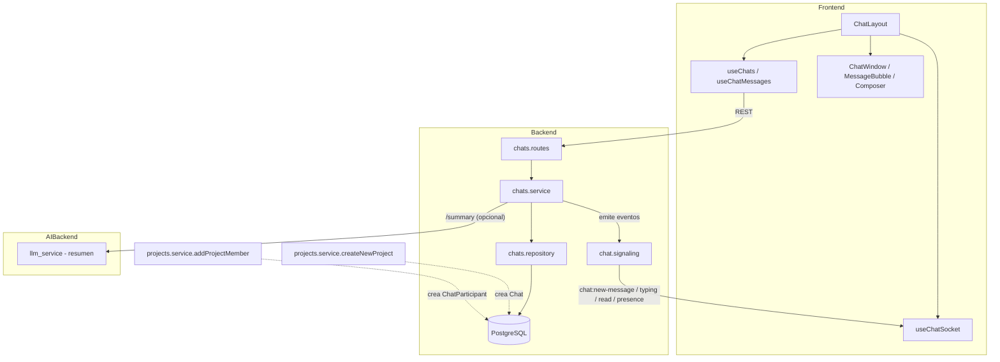

# Plan de implementación — Módulo de Chat

**Estado:** ✅ Implementado (2026-06-15) — ver [`review/chat-module-review.md`](review/chat-module-review.md)
**Mockup de referencia:** `task_manager_front/app/(dashboard)/chats/page.tsx` (UI estática con datos hardcodeados)

---

## 1. Objetivo

Como usuario autenticado quiero:

1. Tener un **chat de grupo automático** por cada proyecto del que soy miembro, creado al momento de crear el proyecto (y poblado con sus miembros automáticamente al agregarlos).
2. Poder **chatear individualmente (1 a 1)** con cualquier otro usuario de la plataforma.
3. Ver mensajes en **tiempo real** (sin recargar), con indicadores de escritura, presencia online y estado de lectura, igual que en el mockup.
4. Aprovechar la integración con el resto del producto (tareas, IA) para funciones diferenciadoras descritas en la sección 9.

---

## 2. Contexto actual del repositorio

| Área | Estado |
| --- | --- |
| UI de chat | Mockup estático en `app/(dashboard)/chats/page.tsx`, datos de `lib/people.ts`, sin backend |
| Tiempo real | Ya existe un servidor Socket.IO (`src/signaling/signaling.server.ts`) montado en el mismo `httpServer`, en `/socket.io`, con auth por cookie JWT (jose) |
| Proxy frontend | `next.config.mjs` ya reescribe `/socket.io/*` hacia el backend |
| Proyectos | `Project` + `ProjectMember` (con `isActive`); creación vía `createNewProject`, alta de miembros vía `addProjectMember` |
| Patrón de módulos | `routes → controllers → services → repositories` + Zod, ya usado en `meetings`, `dashboard`, etc. |
| Subida de archivos | `multer` (memory storage) para audio de reuniones + `src/services/audio-storage.service.ts`: si `AWS_S3_BUCKET`/`AWS_REGION` están configurados sube a S3 (`storeAudio` → `s3://bucket/key`), si no cae a disco local bajo `AUDIO_UPLOAD_DIR` y lo sirve vía `/uploads/audio` |
| Respuesta API | `{ success, message?, data, errors? }` vía `sendSuccess` / `sendCreated` |
| Cliente frontend | `features/<name>/` con `.api.ts` / `.hooks.ts` / `.types.ts`; sockets ya se consumen con un hook dedicado (`features/video-call/useSignaling.ts`) |
| Tipado de routers | Los routers ahora se tipan explícitamente: `export const xRouter: ExpressRouter = Router()` (import `type { Router as ExpressRouter }` de `express`) |

---

## 3. Historias de usuario

> **HU-CHAT-1:** Como miembro de un proyecto, al crearse el proyecto se crea automáticamente un chat de grupo con todos sus miembros actuales y futuros, para coordinar sin salir de la app.

> **HU-CHAT-2:** Como usuario, puedo iniciar o continuar una conversación 1 a 1 con cualquier otro usuario de la plataforma desde la sección "Chats" o desde su perfil en "People".

> **HU-CHAT-3:** Como usuario, veo mensajes nuevos en tiempo real, sé quién está escribiendo, quién está en línea, y el estado de mis mensajes (enviado / entregado / leído).

> **HU-CHAT-4 (innovador):** Como usuario, puedo convertir cualquier mensaje del chat de grupo en una **tarea** del proyecto con un clic, sin salir del chat.

> **HU-CHAT-5 (innovador):** Como usuario que vuelve a un chat de grupo con muchos mensajes nuevos, puedo pedir un **resumen generado por IA** ("¿Qué me perdí?") de lo que se discutió.

### Criterios de aceptación (alto nivel)

- [ ] Crear un proyecto crea su chat de grupo; agregar un miembro al proyecto lo agrega al chat.
- [ ] `/chats` lista chats de grupo (proyectos) y chats directos, con último mensaje, hora y no leídos.
- [ ] Abrir un chat carga historial paginado y se suscribe a mensajes en tiempo real.
- [ ] Enviar mensaje lo persiste en BD y lo emite por socket a los demás participantes conectados.
- [ ] Indicador de "escribiendo…" y de presencia (online/offline) funcionan vía socket.
- [ ] Estado de mensaje propio pasa de `sent` → `delivered` → `read` según receptores.
- [ ] Reacciones con emoji y respuestas (reply) a mensajes funcionan.
- [ ] "Convertir en tarea" crea una `Task` en la primera columna del proyecto, vinculada al mensaje origen.
- [ ] `npm run typecheck` (frontend) y `npm run build` (backend) pasan sin errores.

---

## 4. Modelo de datos (Prisma)

### 4.1 Nuevas entidades

```prisma
enum ChatType {
  PROJECT   // chat de grupo, 1:1 con un Project
  DIRECT    // chat 1 a 1 entre dos usuarios
}

enum MessageType {
  TEXT
  IMAGE
  FILE
  SYSTEM    // mensajes automáticos: "X se unió al proyecto", etc.
}

model Chat {
  id           String            @id @default(uuid())
  type         ChatType
  projectId    String?           @unique   // solo para ChatType.PROJECT
  createdAt    DateTime          @default(now())
  updatedAt    DateTime          @updatedAt
  project      Project?          @relation(fields: [projectId], references: [id], onDelete: Cascade)
  participants ChatParticipant[]
  messages     Message[]

  @@index([type])
}

model ChatParticipant {
  id         String    @id @default(uuid())
  chatId     String
  userId     String
  joinedAt   DateTime  @default(now())
  lastReadAt DateTime?
  isActive   Boolean   @default(true)
  chat       Chat      @relation(fields: [chatId], references: [id], onDelete: Cascade)
  user       User      @relation(fields: [userId], references: [id])

  @@unique([chatId, userId])
  @@index([userId])
}

model Message {
  id            String       @id @default(uuid())
  chatId        String
  senderId      String?      // null para mensajes SYSTEM
  type          MessageType  @default(TEXT)
  content       String
  attachmentUrl String?
  replyToId     String?
  editedAt      DateTime?
  deletedAt     DateTime?
  createdAt     DateTime     @default(now())
  chat          Chat         @relation(fields: [chatId], references: [id], onDelete: Cascade)
  sender        User?        @relation("MessageSender", fields: [senderId], references: [id])
  replyTo       Message?     @relation("MessageReplies", fields: [replyToId], references: [id])
  replies       Message[]    @relation("MessageReplies")
  reactions     MessageReaction[]
  taskSuggestion ChatTaskLink?

  @@index([chatId, createdAt])
}

model MessageReaction {
  id        String  @id @default(uuid())
  messageId String
  userId    String
  emoji     String
  createdAt DateTime @default(now())
  message   Message @relation(fields: [messageId], references: [id], onDelete: Cascade)
  user      User    @relation(fields: [userId], references: [id])

  @@unique([messageId, userId, emoji])
}

// HU-CHAT-4: vínculo mensaje -> tarea creada desde el chat
model ChatTaskLink {
  id        String  @id @default(uuid())
  messageId String  @unique
  taskId    String  @unique
  message   Message @relation(fields: [messageId], references: [id], onDelete: Cascade)
  task      Task    @relation(fields: [taskId], references: [id], onDelete: Cascade)
}
```

### 4.2 Relaciones a agregar en modelos existentes

```prisma
// User
chats             ChatParticipant[]
messagesSent      Message[]          @relation("MessageSender")
messageReactions  MessageReaction[]

// Project
chat              Chat?
```

### 4.3 Reglas de negocio

| Regla | Implementación |
| --- | --- |
| Al crear un proyecto, se crea su `Chat` (`type = PROJECT`) y un `ChatParticipant` para el creador | Hook en `projects.service.createNewProject` |
| Al agregar un miembro al proyecto, se agrega/reactiva su `ChatParticipant` en el chat del proyecto | Hook en `projects.service.addProjectMember` |
| Un chat `DIRECT` entre A y B es único — `findOrCreate` por par de `userId` ordenado | `chats.service.getOrCreateDirectChat` |
| `lastReadAt` de un `ChatParticipant` se actualiza al llamar `PATCH /chats/:id/read` o al unirse al room del chat estando activo | `chats.service.markRead` |
| Estado visual de un mensaje propio: `sent` (persistido), `delivered` (algún otro participante con socket conectado al chat), `read` (todos los demás participantes activos tienen `lastReadAt >= message.createdAt`) | Calculado en `chats.service`, no se persiste por mensaje |
| Solo el autor puede editar/borrar (soft delete) su mensaje, dentro de una ventana razonable (p.ej. 15 min para editar) | Validación en `chats.service` |
| "Convertir en tarea" requiere ser miembro activo del proyecto del chat | `membershipMiddleware` reutilizado vía `projectId` derivado del chat |

---

## 5. API Backend — módulo `src/modules/chats/`

Sigue el patrón `routes → controllers → services → repositories`, con `chats.schema.ts` (Zod).

### 5.1 Endpoints REST

| Método | Ruta | Descripción |
| --- | --- | --- |
| `GET` | `/api/v1/chats` | Lista los chats del usuario (proyecto + directos), con `lastMessage`, `unreadCount`, participantes |
| `GET` | `/api/v1/chats/:chatId` | Detalle de un chat (participantes, info del proyecto si aplica) |
| `GET` | `/api/v1/chats/:chatId/messages` | Historial paginado (`?cursor=<messageId>&limit=30`), orden descendente |
| `POST` | `/api/v1/chats/:chatId/messages` | Envía mensaje (texto / referencia a adjunto ya subido); emite por socket |
| `PATCH` | `/api/v1/chats/messages/:messageId` | Edita el contenido (solo autor, ventana de tiempo) |
| `DELETE` | `/api/v1/chats/messages/:messageId` | Soft delete (solo autor) |
| `POST` | `/api/v1/chats/messages/:messageId/reactions` | Toggle de reacción (`{ emoji }`) |
| `PATCH` | `/api/v1/chats/:chatId/read` | Marca el chat como leído hasta ahora (`lastReadAt = now()`) |
| `POST` | `/api/v1/chats/direct` | `{ userId }` → obtiene o crea el chat directo con ese usuario |
| `POST` | `/api/v1/chats/:chatId/attachments` | Sube imagen/archivo (multer + `file-storage.service`, S3 o disco según config); crea el `Message` y devuelve su `attachmentUrl` proxy |
| `GET` | `/api/v1/chats/attachments/:messageId` | Sirve el adjunto (S3 o disco) autenticado, con el `Content-Type` original — ver §8.2 |
| `POST` | `/api/v1/chats/messages/:messageId/convert-to-task` | **HU-CHAT-4** — crea `Task` + `ChatTaskLink` a partir del mensaje |
| `POST` | `/api/v1/chats/:chatId/summary` | **HU-CHAT-5** — proxy al AI backend para resumir mensajes no leídos/recientes |
| `GET` | `/api/v1/projects/:projectId/chat` | Atajo: devuelve el `chatId` del chat de grupo del proyecto |

Todas protegidas con `authMiddleware`; las que reciben `:chatId` validan membresía vía un `chatMembershipMiddleware` nuevo (verifica `ChatParticipant` activo, en vez de `ProjectMember`).

### 5.2 Forma de `GET /chats` (response `data`)

```typescript
interface ChatSummary {
  id: string
  type: "PROJECT" | "DIRECT"
  name: string                 // nombre del proyecto, o nombre del otro usuario
  avatarUrl?: string
  projectId?: string
  participants: Array<{ userId: string; name: string; imageUrl?: string; isOnline: boolean }>
  lastMessage?: {
    id: string
    senderId: string | null
    type: "TEXT" | "IMAGE" | "FILE" | "SYSTEM"
    preview: string             // texto truncado o "📷 Imagen" / "📎 Archivo"
    createdAt: string
  }
  unreadCount: number
}
```

### 5.3 Forma de `GET /chats/:chatId/messages` y `POST .../messages`

```typescript
interface ChatMessage {
  id: string
  chatId: string
  senderId: string | null
  senderName: string | null
  type: "TEXT" | "IMAGE" | "FILE" | "SYSTEM"
  content: string
  attachmentUrl?: string   // proxy autenticado: /api/v1/chats/attachments/:messageId (ver §8.2)
  replyTo?: { id: string; senderName: string | null; preview: string }
  reactions: Array<{ emoji: string; userIds: string[] }>
  status: "sent" | "delivered" | "read"   // calculado para el usuario que pide
  createdAt: string
  editedAt?: string
}
```

### 5.4 Montaje en `app.ts`

```typescript
import { chatsRouter } from "./modules/chats/chats.routes";
app.use("/api/v1", chatsRouter); // rutas absolutas: /chats, /chats/:chatId/..., /projects/:projectId/chat
```

---

## 6. Tiempo real (Socket.IO)

Reutilizar el `Server` ya creado en `setupSignaling` (mismo `httpServer`, mismo `/socket.io`, misma autenticación por cookie JWT). Agregar un nuevo archivo `src/signaling/chat.signaling.ts` con `registerChatHandlers(io)`, invocado desde `setupSignaling` después de crear `io`.

### 6.1 Rooms

- Cada usuario conectado se une automáticamente a `user:<userId>` (para notificaciones de chats nuevos / mensajes directos sin tener el chat abierto).
- Al abrir un chat, el cliente emite `chat:join` y se une a `chat:<chatId>` (verifica `ChatParticipant` activo).

### 6.2 Eventos cliente → servidor

| Evento | Payload | Acción |
| --- | --- | --- |
| `chat:join` | `{ chatId }` | Verifica membresía, hace `socket.join`, marca presencia |
| `chat:leave` | `{ chatId }` | `socket.leave` |
| `chat:typing` | `{ chatId, isTyping: boolean }` | Reenvía a la room (excepto emisor) |
| `chat:send` *(opcional, además del REST)* | `{ chatId, ... }` | Atajo realtime; igual el POST REST es la fuente de verdad |

### 6.3 Eventos servidor → cliente

| Evento | Payload | Cuándo |
| --- | --- | --- |
| `chat:new-message` | `ChatMessage` | Tras `POST .../messages`, emitido a `chat:<chatId>` y a `user:<userId>` de cada participante (para actualizar la lista de chats aunque no esté abierto) |
| `chat:message-updated` | `ChatMessage` | Edición / soft delete |
| `chat:reaction-updated` | `{ messageId, reactions }` | Toggle de reacción |
| `chat:typing` | `{ chatId, userId, isTyping }` | Relay de `chat:typing` |
| `chat:read` | `{ chatId, userId, lastReadAt }` | Tras `PATCH /chats/:id/read`, para actualizar "✓✓ azul" en los demás clientes |
| `chat:presence` | `{ userId, isOnline }` | Conexión/desconexión global (reutiliza el tracking que ya existe para reuniones, generalizado) |
| `chat:task-created` | `{ messageId, taskId }` | Tras convertir un mensaje en tarea |

---

## 7. Frontend — `features/chats/`

### 7.1 Estructura de feature

```
task_manager_front/features/chats/
├── chats.api.ts
├── chats.hooks.ts
├── chats.types.ts
├── useChatSocket.ts          # análogo a video-call/useSignaling.ts, pero para /socket.io chat:*
├── ChatLayout.tsx             # layout de 2 columnas (lista + conversación), basado en el mockup
├── ChatList.tsx
├── ChatListItem.tsx
├── ChatWindow.tsx
├── MessageBubble.tsx
├── MessageComposer.tsx
├── TypingIndicator.tsx
├── ReactionPicker.tsx
├── ConvertToTaskDialog.tsx    # HU-CHAT-4
└── ChatSummaryDialog.tsx      # HU-CHAT-5
```

### 7.2 Página

Reemplazar `app/(dashboard)/chats/page.tsx` (hoy con datos hardcodeados de `lib/people.ts`) por:

```tsx
"use client"
import { ChatLayout } from "@/features/chats/ChatLayout"
export default function ChatsPage() {
  return <ChatLayout />
}
```

Mantener el layout visual existente (sidebar de chats + panel de conversación + burbujas con avatar/estado/✓✓) como base de diseño — es el mockup de referencia del usuario.

### 7.3 Hooks TanStack Query

| Hook | Query key | Endpoint |
| --- | --- | --- |
| `useChats()` | `["chats"]` | `GET /chats` |
| `useChatMessages(chatId)` | `["chats", chatId, "messages"]` (infinite query, cursor) | `GET /chats/:chatId/messages` |
| `useSendMessage(chatId)` | mutación → invalida/actualiza cache de mensajes y de `["chats"]` | `POST /chats/:chatId/messages` |
| `useMarkChatRead(chatId)` | mutación | `PATCH /chats/:chatId/read` |
| `useToggleReaction(messageId)` | mutación | `POST /chats/messages/:id/reactions` |
| `useGetOrCreateDirectChat()` | mutación | `POST /chats/direct` |
| `useConvertMessageToTask(messageId)` | mutación | `POST /chats/messages/:id/convert-to-task` |
| `useChatSummary(chatId)` | mutación | `POST /chats/:chatId/summary` |

### 7.4 `useChatSocket`

- Conecta una sola vez (a nivel de `ChatLayout`) al namespace por defecto, igual que `useSignaling.ts` (mismo `SOCKET_URL`, `path: "/socket.io"`, `withCredentials: true`).
- Se suscribe a `chat:new-message`, `chat:message-updated`, `chat:reaction-updated`, `chat:typing`, `chat:read`, `chat:presence`.
- Al recibir `chat:new-message`, actualiza con `queryClient.setQueryData` tanto la lista de mensajes del chat abierto como el `lastMessage`/`unreadCount` en `["chats"]`.
- Emite `chat:join` / `chat:leave` al cambiar de chat seleccionado, y `chat:typing` con debounce desde `MessageComposer`.

### 7.5 Entradas a chats directos desde "People"

En `app/(dashboard)/people/page.tsx`, agregar un botón "Mensaje" por persona que llama a `useGetOrCreateDirectChat()` y navega a `/chats?chatId=<id>`.

### 7.6 i18n

Agregar namespace `chat.*` en `lib/i18n/messages/es.json` y `en.json`: títulos, placeholders, estados ("Escribiendo…", "En línea", "Convertir en tarea", "Resumir chat", etc.).

---

## 8. Subida de adjuntos (imágenes/archivos)

El backend ya resuelve almacenamiento de audio de reuniones de forma híbrida (S3 si está configurado, disco local si no) en `src/services/audio-storage.service.ts`. Para adjuntos de chat se **generaliza** ese servicio en lugar de duplicarlo, ya que el sistema corre detrás de un proxy autenticado (cookie httpOnly) y no conviene exponer URLs S3 públicas.

### 8.1 Generalizar `audio-storage.service.ts` → `file-storage.service.ts`

- Extraer la lógica común a `storeFile(category, id, buffer, extension, contentType)` y `readFile(fileUrl)`, parametrizadas por `category` (`"meetings/audio"` | `"chat/attachments"`), reutilizando el mismo `S3Client` (mismas `AWS_REGION` / `AWS_ACCESS_KEY_ID` / `AWS_SECRET_ACCESS_KEY` / `AWS_S3_BUCKET`).
- Nueva variable `AWS_S3_CHAT_PREFIX` (default `chat/attachments`), análoga a `AWS_S3_AUDIO_PREFIX`.
- `audio-storage.service.ts` pasa a ser un wrapper delgado de `file-storage.service.ts` (mantiene `storeAudio`/`readAudio`/`inferExtensionFromMime` para no tocar `meetings`).
- Resultado de `storeFile`: igual que hoy — `s3://bucket/key` si S3 está configurado, o `/uploads/chat/<filename>` si es disco local (`CHAT_UPLOAD_DIR`, default `./public/uploads/chat`, servido por `express.static` solo en desarrollo).

### 8.2 Endpoint de subida y de servido

- `POST /api/v1/chats/:chatId/attachments` — `multer` `memoryStorage`, límite 10MB, valida `mimetype` (`image/*`, `application/pdf`, `.docx`, etc.). Llama a `storeFile("chat/attachments", chatId, buffer, ext, mimetype)` y persiste internamente la URL devuelta (S3 o local) junto con `mimetype` — **no** se expone esa URL cruda al cliente.
- `GET /api/v1/chats/attachments/:messageId` — endpoint **autenticado** (cookie JWT + `chatMembershipMiddleware`) que llama a `readFile(message.attachmentUrl)` y hace `res.send(buffer)` con el `Content-Type` guardado. Funciona igual con almacenamiento local o S3, sin exponer credenciales ni buckets.
- El campo `attachmentUrl` que ve el frontend en `ChatMessage` **siempre** es la ruta proxy `/api/v1/chats/attachments/:messageId` (relativa, vía `api-client`/`next.config.mjs`), nunca la URL de almacenamiento real.

### 8.3 Flujo end-to-end

1. Cliente sube el archivo → `POST /chats/:chatId/attachments` → backend lo guarda (S3 o local) y crea el `Message` (`type: IMAGE | FILE`, `attachmentUrl` interno = `s3://...` o `/uploads/chat/...`).
2. Respuesta y evento `chat:new-message` incluyen `attachmentUrl: "/api/v1/chats/attachments/<messageId>"`.
3. El cliente renderiza `">` (o un link de descarga para `FILE`); el navegador la pide con la cookie de sesión incluida (`credentials: "include"`).

---

## 9. Funcionalidades innovadoras (fuera de lo básico)

Estas son las que diferencian este chat de un chat genérico, aprovechando lo que el resto del sistema ya tiene:

1. **"Convertir en tarea" (HU-CHAT-4)** — Cualquier miembro puede convertir un mensaje del chat de grupo en una tarea del proyecto (columna inicial, prioridad por defecto `MEDIUM`, `responsibleId` opcional = remitente del mensaje). Se inserta un mensaje `SYSTEM` ("✅ Se creó la tarea «...» a partir de este mensaje") y un badge "📋 Tarea creada" se renderiza sobre el mensaje original (vía `ChatTaskLink`). Conecta naturalmente con `features/kanban`.

2. **"¿Qué me perdí?" — resumen con IA (HU-CHAT-5)** — Botón en `ChatWindow` que llama `POST /chats/:chatId/summary`; el backend junta los mensajes desde el `lastReadAt` del usuario y los reenvía al AI backend (mismo `AI_PROVIDER`/`llm_service` ya usado para minutas), devolviendo 3-5 bullets. Mismo patrón de timeout largo (`AI_FETCH_TIMEOUT_MS`) que las demás llamadas a IA.

3. **Reacciones rápidas + respuestas (reply)** — estándar en chats modernos, reutilizan `MessageReaction`/`replyToId` ya modelados; refuerzan la sensación de producto "completo".

4. **Presencia global** — el badge verde "online" del mockup deja de ser estático: se calcula desde los sockets conectados (reutilizando/generalizando el tracking de `rooms`/participantes que ya existe para videollamadas).

5. **Menciones `@nombre`** — al escribir `@`, autocompletar con miembros del chat; un mensaje con mención del usuario actual se resalta y suma al contador de no leídos aunque el chat esté silenciado (mute, ver punto 6).

6. **Mute por chat** *(stretch)* — campo `mutedUntil` opcional en `ChatParticipant` para silenciar notificaciones de un chat de grupo ruidoso sin salir de él.

7. **Mensajes ancla / pin** *(stretch)* — campo `pinned: Boolean` en `Message`; un panel lateral muestra mensajes fijados (acuerdos importantes), reflejando el concepto de `Agreement` que ya existe para minutas, pero para chat informal.

---

## 10. Plan de trabajo por fases

### Fase 1 — Modelo de datos (backend)

| # | Tarea | Archivos |
| --- | --- | --- |
| 1.1 | Agregar enums/modelos `Chat`, `ChatParticipant`, `Message`, `MessageReaction`, `ChatTaskLink` + relaciones en `User`/`Project`/`Task` | `prisma/schema.prisma`, migración |
| 1.2 | Hook de auto-creación de chat de grupo al crear proyecto | `projects.service.createNewProject`, `projects.repository.ts` |
| 1.3 | Hook de alta/reactivación de `ChatParticipant` al agregar miembro | `projects.service.addProjectMember` |
| 1.4 | Seeder: chats de grupo para proyectos demo existentes (backfill) + 1-2 chats directos de ejemplo | `prisma/seed.ts` o script de migración de datos |

**Entregable:** proyectos existentes y nuevos tienen su chat de grupo poblado.

### Fase 2 — API REST (backend)

| # | Tarea | Archivos |
| --- | --- | --- |
| 2.1 | `chats.repository.ts` (queries Prisma: listar chats con último mensaje/no leídos, mensajes paginados, etc.) | `src/modules/chats/chats.repository.ts` |
| 2.2 | `chats.service.ts` (reglas de negocio: estado de mensaje, direct chat findOrCreate, convert-to-task, etc.) | `chats.service.ts` |
| 2.3 | `chats.controller.ts` + `chats.schema.ts` (Zod) | `chats.controller.ts`, `chats.schema.ts` |
| 2.4 | `chats.routes.ts` + `chatMembershipMiddleware` + montaje en `app.ts` | `chats.routes.ts`, `src/middlewares/`, `app.ts` |
| 2.5 | Generalizar `audio-storage.service.ts` → `file-storage.service.ts` (`storeFile`/`readFile` por `category`); endpoints de subida (`POST .../attachments`) y de servido (`GET /chats/attachments/:messageId`) | `src/services/file-storage.service.ts`, `src/services/audio-storage.service.ts` (wrapper), `chats.routes.ts`, `env.ts` (`AWS_S3_CHAT_PREFIX`, `CHAT_UPLOAD_DIR`) |
| 2.6 | Pruebas manuales vía Swagger/curl | `docs/manual-testing/chats.md` (opcional) |

**Entregable:** API de chats completa y documentada en Swagger.

### Fase 3 — Tiempo real (backend)

| # | Tarea | Archivos |
| --- | --- | --- |
| 3.1 | `chat.signaling.ts`: rooms `user:<id>` y `chat:<id>`, handlers `chat:join/leave/typing` | `src/signaling/chat.signaling.ts` |
| 3.2 | Emitir `chat:new-message` / `chat:message-updated` / `chat:reaction-updated` / `chat:read` desde `chats.service` vía `getSignalingServer()` | `chats.service.ts`, `chat.signaling.ts` |
| 3.3 | Generalizar presencia (`chat:presence`) a partir del tracking de conexiones existente | `signaling.server.ts`, `chat.signaling.ts` |

**Entregable:** mensajes, reacciones, lectura y presencia se propagan en tiempo real.

### Fase 4 — Frontend core (chat de grupo y directo)

| # | Tarea | Archivos |
| --- | --- | --- |
| 4.1 | `features/chats/chats.api.ts` / `.types.ts` | nuevos |
| 4.2 | `chats.hooks.ts` (queries + mutations de la sección 7.3) | nuevo |
| 4.3 | `useChatSocket.ts` | nuevo |
| 4.4 | `ChatLayout`, `ChatList`, `ChatListItem`, `ChatWindow`, `MessageBubble`, `MessageComposer`, `TypingIndicator` (basados en el mockup) | nuevos |
| 4.5 | Reemplazar `app/(dashboard)/chats/page.tsx` | modificado |
| 4.6 | Botón "Mensaje" en `/people` → `useGetOrCreateDirectChat` | `app/(dashboard)/people/page.tsx` |
| 4.7 | i18n `chat.*` | `lib/i18n/messages/*.json` |
| 4.8 | `npm run typecheck` | — |

**Entregable:** chat de grupo por proyecto + chats directos, en tiempo real, funcionando en `http://localhost:3000/chats`.

### Fase 5 — Funcionalidades innovadoras

| # | Tarea | Archivos |
| --- | --- | --- |
| 5.1 | Reacciones (`ReactionPicker`, endpoint, socket) | back + front |
| 5.2 | Reply / hilos (`replyToId`, UI de "responder a") | back + front |
| 5.3 | "Convertir en tarea" (`ConvertToTaskDialog`, endpoint, badge en mensaje, mensaje SYSTEM) | back + front |
| 5.4 | Adjuntos imagen/archivo: UI de subida en `MessageComposer`, render de `` / link de descarga (backend ya resuelto en Fase 2.5) | front |
| 5.5 | Menciones `@usuario` con autocompletado | front (+ resaltado backend opcional) |
| 5.6 | **(opcional/stretch)** Resumen con IA (`ChatSummaryDialog`, endpoint `summary`, llamada a `llm_service` del AI backend) | back + AI back + front |
| 5.7 | **(opcional/stretch)** Mute por chat, mensajes fijados | back + front |

**Entregable:** experiencia de chat diferenciada respecto a un chat genérico.

### Fase 6 — Pulido y pruebas

| # | Tarea |
| --- | --- |
| 6.1 | Responsive (lista colapsable en móvil, igual que el mockup ya contempla parcialmente) |
| 6.2 | Estados vacíos: sin chats, sin mensajes, sin resultados de búsqueda |
| 6.3 | Manejo de reconexión de socket (reintentos, banner "Reconectando…") |
| 6.4 | Checklist de aceptación (sección 3) |

---

## 11. Checklist de pruebas manuales

### Datos y creación automática

- [ ] Crear un proyecto crea su `Chat` tipo `PROJECT` con el creador como participante.
- [ ] Agregar un miembro al proyecto lo agrega como `ChatParticipant` activo.
- [ ] `/chats` muestra el chat del proyecto con nombre = nombre del proyecto.

### Chat directo

- [ ] Desde "People", iniciar chat con otro usuario crea (o reabre) un `Chat` tipo `DIRECT`.
- [ ] Repetir la acción no crea un segundo chat duplicado.

### Tiempo real

- [ ] Dos sesiones (navegadores distintos) ven los mensajes del otro sin recargar.
- [ ] Indicador de "escribiendo…" aparece y desaparece correctamente.
- [ ] Estado de mensaje propio cambia de `sent` → `read` cuando el receptor abre el chat.
- [ ] Presencia online/offline se actualiza al conectar/desconectar.

### Funcionalidades innovadoras

- [ ] Reaccionar con emoji a un mensaje, y que el otro usuario lo vea en tiempo real.
- [ ] Responder a un mensaje muestra la cita del mensaje original.
- [ ] "Convertir en tarea" crea la tarea en el Kanban del proyecto y un mensaje de sistema en el chat.
- [ ] Subir una imagen y verla renderizada en la conversación.
- [ ] (Si se implementa) "¿Qué me perdí?" devuelve un resumen coherente de los mensajes no leídos.

### Regresión

- [ ] `npm run typecheck` (frontend) sin errores.
- [ ] `npm run build` (backend) sin errores.
- [ ] Resto de rutas (`/projects`, `/meetings`, `/dashboard`) sin cambios rotos.

---

## 12. Riesgos y mitigaciones

| Riesgo | Mitigación |
| --- | --- |
| Cálculo de `status` (sent/delivered/read) por mensaje puede ser costoso con muchos participantes | Calcular solo para mensajes recientes / visibles en viewport; cachear `lastReadAt` por participante |
| Volumen de mensajes en chats de proyectos grandes | Paginación por cursor (`createdAt`/`id`), límite por defecto 30 |
| Doble fuente de verdad (REST vs socket) para enviar mensajes | El socket **no** persiste mensajes; siempre se persisten vía REST y luego se emiten — evita duplicados/inconsistencias |
| Backfill de chats para proyectos ya existentes | Script de migración de datos (Fase 1.4), idempotente (verifica si `Project.chat` ya existe) |
| Resumen con IA puede fallar/tardar (igual que transcripción) | Reutilizar `AI_FETCH_TIMEOUT_MS` y manejo de error ya existente; función claramente marcada como opcional/stretch |
| Adjuntos sin límite (disco o S3) | Límite de tamaño en multer (10MB) + tipos permitidos (`image/*`, `application/pdf`, etc.) antes de llamar a `storeFile` |
| Exponer URLs/credenciales S3 al frontend | `attachmentUrl` expuesto al cliente es siempre el proxy autenticado `/api/v1/chats/attachments/:messageId`; la URL real (`s3://...` o ruta local) nunca sale del backend |
| Generalizar `audio-storage.service.ts` rompe el flujo de audio de reuniones | `audio-storage.service.ts` queda como wrapper de `file-storage.service.ts` con la misma firma (`storeAudio`/`readAudio`); cubrir con prueba manual de subida/transcripción de audio tras el refactor |

---

## 13. Diagrama de flujo de datos



---

*Documento generado para el incremento "Módulo de Chat" (Sprint 3). Actualizar el campo **Estado** al iniciar cada fase.*
