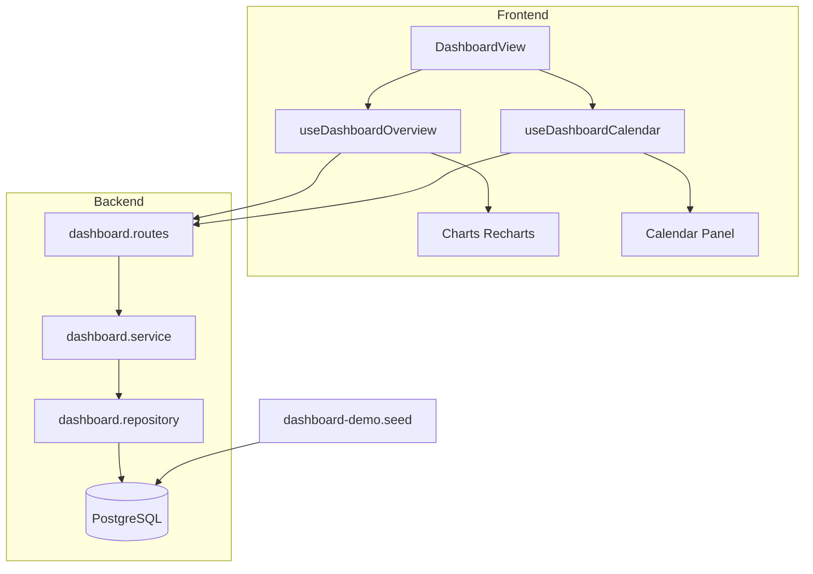

# Plan de implementación — Dashboard Scrum

**Estado:** Pendiente  
**Usuario de prueba:** `alex@example.com` / contraseña `string123`  
**Página actual:** `ComingSoonPage` en `/dashboard`

---

## 1. Objetivo

Como usuario autenticado quiero un **panel central** donde pueda:

1. **Controlar el estado de mis proyectos** — ver salud, progreso y acceder rápido a cada proyecto.
2. **Visualizar métricas Scrum** con gráficos útiles (burndown, burnup, barras, torta, líneas).
3. **Consultar un calendario lateral** con próximas entregas, fechas límite de tareas y reuniones importantes en todos mis proyectos.

El dashboard debe funcionar con **datos reales de PostgreSQL**, poblados mediante un **seeder dedicado** para el usuario Alex.

---

## 2. Contexto actual del repositorio


| Área                | Estado                                                                                              |
| ------------------- | --------------------------------------------------------------------------------------------------- |
| Ruta `/dashboard`   | Placeholder (`ComingSoonPage`)                                                                      |
| Gráficos UI         | `components/ui/chart.tsx` (Recharts + shadcn) ya instalado                                          |
| Calendario UI       | `components/ui/calendar.tsx` (react-day-picker) ya instalado                                        |
| Proyectos           | CRUD + membresía; `status` = `ACTIVE` | `INACTIVE`                                                  |
| Tareas              | Kanban por columnas (`Pending`, `In Progress`, `Done`); `dueDate`, `priority`                       |
| Reuniones           | `scheduledAt`, tipos `REGULAR` | `DAILY` | `SPRINT_PLANNING`; listado global `GET /api/v1/meetings` |
| Sprints             | **No existe modelo** — necesario para burndown/burnup reales                                        |
| Historial de tareas | **No existe** — `updatedAt` no basta para burndown diario                                           |
| Seeder              | Solo crea 3 roles; sin usuarios ni datos de demo                                                    |


---

## 3. Historia de usuario

> **HU-DASH-1:** Como miembro de uno o más proyectos, quiero ver en un solo lugar el estado de mis proyectos, gráficos de progreso al estilo Scrum y un calendario con mis próximas fechas importantes, para priorizar mi trabajo sin entrar proyecto por proyecto.

### Criterios de aceptación

- [ ] Al iniciar sesión como `alex@example.com`, `/dashboard` muestra datos (no placeholder).
- [ ] Se ven al menos **4 gráficos** con datos coherentes de Scrum.
- [ ] El panel lateral derecho muestra un **calendario** con días marcados y una **lista de próximos eventos** (tareas con `dueDate`, reuniones con `scheduledAt`, fin de sprint).
- [ ] Puedo filtrar métricas por **proyecto** o ver **todos mis proyectos**.
- [ ] Las tarjetas de proyecto muestran progreso (% tareas en columna Done) y enlace al detalle.
- [ ] `npm run prisma:seed` (o comando documentado) deja la BD lista para probar el dashboard.
- [ ] `npm run typecheck` en frontend pasa sin errores.

---

## 4. Diseño de la vista

### 4.1 Layout (desktop ≥ `lg`)

```
┌─────────────────────────────────────────────────────────────────────────┐
│  Panel — Hola, Alex                                    [Filtro proyecto ▼]│
├──────────────────────────────────────────────┬──────────────────────────┤
│  KPI cards (4): Proyectos | Tareas | Vencidas │  Calendario (mes actual) │
│  | Reuniones esta semana                     │  con dots por tipo       │
├──────────────────────────────────────────────┤                          │
│  Tarjetas de estado por proyecto (scroll)    │  Próximos eventos (lista)│
├──────────────────────────────────────────────┤  — tarea vence 15/06     │
│  Burndown (líneas)     │  Burnup (líneas)    │  — Daily Scrum 16/06     │
├────────────────────────┼─────────────────────┤  — Sprint Review 20/06   │
│  Tareas por columna    │  Tareas por prioridad│                          │
│  (torta)               │  (barras)            │                          │
├────────────────────────┴─────────────────────┤                          │
│  Velocidad / completadas por semana (barras) │                          │
└──────────────────────────────────────────────┴──────────────────────────┘
```

### 4.2 Layout (móvil)

- Calendario y lista de eventos **debajo** de los gráficos (columna única).
- KPI cards en carrusel horizontal o grid 2×2.

### 4.3 Gráficos propuestos


| Gráfico                         | Tipo Recharts                        | Fuente de datos                                  | Justificación Scrum                               |
| ------------------------------- | ------------------------------------ | ------------------------------------------------ | ------------------------------------------------- |
| Burndown del sprint activo      | `LineChart` (2 series: ideal + real) | Sprint + tareas + `completedAt`                  | Métrica central de seguimiento diario             |
| Burnup del sprint activo        | `LineChart` (alcance + completado)   | Igual que burndown                               | Muestra si el alcance creció vs trabajo entregado |
| Distribución por columna Kanban | `PieChart`                           | Tareas agrupadas por `column.title`              | Vista rápida del flujo de trabajo                 |
| Tareas por prioridad            | `BarChart`                           | `Task.priority`                                  | Ayuda a priorizar backlog                         |
| Completadas por semana          | `BarChart`                           | `Task.completedAt` últimas 4–6 semanas           | Velocidad / throughput del equipo                 |
| Salud del sprint (opcional)     | Badge + mini `BarChart`              | Último `DailyAnalysis.sprintHealth` por proyecto | Conecta con Daily Scrum ya implementado           |


---

## 5. Modelo de datos

### 5.1 Cambios en Prisma

Agregar entidad **Sprint** y extender **Task** para métricas Scrum.

```prisma
enum SprintStatus {
  PLANNED
  ACTIVE
  COMPLETED
}

model Sprint {
  id        String       @id @default(uuid())
  projectId String
  name      String
  goal      String?
  startDate DateTime
  endDate   DateTime
  status    SprintStatus @default(PLANNED)
  createdAt DateTime     @default(now())
  updatedAt DateTime     @updatedAt
  project   Project      @relation(fields: [projectId], references: [id], onDelete: Cascade)
  tasks     Task[]

  @@index([projectId])
  @@index([projectId, status])
}

// En model Task — campos nuevos:
  sprintId      String?
  storyPoints   Int       @default(1)
  completedAt   DateTime?
  sprint        Sprint?   @relation(fields: [sprintId], references: [id])

// En model Project — relación:
  sprints       Sprint[]
```

### 5.2 Reglas de negocio


| Regla                                                                                                        | Implementación                                                   |
| ------------------------------------------------------------------------------------------------------------ | ---------------------------------------------------------------- |
| `completedAt` se setea al mover tarea a columna cuya posición es la **última** del proyecto (columna “Done”) | Hook en `tasks.service` / `kanban.service` al `PATCH .../column` |
| `completedAt` se limpia si la tarea sale de Done                                                             | Mismo hook                                                       |
| Un proyecto puede tener **un solo sprint ACTIVE**                                                            | Validar en servicio al activar sprint                            |
| Burndown usa **storyPoints** si existen; si no, cuenta **1 por tarea**                                       | Lógica en `dashboard.service`                                    |
| Calendario incluye eventos solo de proyectos donde el usuario es **miembro activo**                          | Filtro por `ProjectMember.isActive`                              |


### 5.3 Qué NO se agrega en esta fase

- Tabla de snapshots diarios (`SprintBurndownSnapshot`) — se calcula en tiempo real desde `completedAt` + rango del sprint; el seeder backdatea `completedAt` para curvas creíbles.
- CRUD completo de sprints en UI — solo API mínima + datos del seeder; gestión avanzada puede ser Sprint 3.

---

## 6. API Backend

Nuevo módulo `src/modules/dashboard/` siguiendo el patrón `routes → controllers → services → repositories`.

### 6.1 Endpoints


| Método  | Ruta                         | Descripción                                                 |
| ------- | ---------------------------- | ----------------------------------------------------------- |
| `GET`   | `/api/v1/dashboard/overview` | KPIs, tarjetas de proyecto, series para todos los gráficos  |
| `GET`   | `/api/v1/dashboard/calendar` | Eventos entre `from` y `to` (ISO date)                      |
| `PATCH` | `/api/v1/projects/:id`       | *(ya existe)* — cambiar `status` del proyecto desde tarjeta |


**Query params de `overview`:**


| Param       | Tipo          | Default                    | Descripción                   |
| ----------- | ------------- | -------------------------- | ----------------------------- |
| `projectId` | UUID opcional | todos                      | Filtra métricas a un proyecto |
| `sprintId`  | UUID opcional | sprint ACTIVE del proyecto | Sprint para burndown/burnup   |


**Query params de `calendar`:**


| Param       | Tipo         | Requerido |
| ----------- | ------------ | --------- |
| `from`      | `YYYY-MM-DD` | sí        |
| `to`        | `YYYY-MM-DD` | sí        |
| `projectId` | UUID         | no        |


### 6.2 Forma de respuesta `overview`

```typescript
interface DashboardOverview {
  kpis: {
    activeProjects: number
    openTasks: number
    overdueTasks: number
    meetingsThisWeek: number
  }
  projects: Array<{
    id: string
    name: string
    status: string
    totalTasks: number
    doneTasks: number
    progressPercent: number
    activeSprint?: { id: string; name: string; endDate: string }
    sprintHealth?: "GREEN" | "YELLOW" | "RED" | null
  }>
  burndown: {
    sprint: { id: string; name: string; startDate: string; endDate: string }
    unit: "storyPoints" | "tasks"
    ideal: Array<{ date: string; remaining: number }>
    actual: Array<{ date: string; remaining: number }>
  } | null
  burnup: {
    scope: Array<{ date: string; total: number }>
    completed: Array<{ date: string; done: number }>
  } | null
  tasksByColumn: Array<{ column: string; count: number; color?: string }>
  tasksByPriority: Array<{ priority: string; count: number }>
  weeklyVelocity: Array<{ weekLabel: string; completed: number }>
}
```

### 6.3 Forma de respuesta `calendar`

```typescript
type CalendarEventType = "TASK_DUE" | "MEETING" | "SPRINT_END"

interface CalendarEvent {
  id: string
  type: CalendarEventType
  title: string
  date: string          // ISO date (día del evento)
  datetime?: string     // ISO datetime si aplica (reuniones)
  projectId: string
  projectName: string
  meta?: {
    priority?: string
    meetingType?: string
    sprintName?: string
  }
}

interface DashboardCalendar {
  events: CalendarEvent[]
}
```

### 6.4 Cálculo de burndown (pseudocódigo)

```typescript
// Para cada día D entre sprint.startDate y sprint.endDate:
const totalScope = tasksInSprint.reduce((s, t) => s + (t.storyPoints ?? 1), 0)
const days = differenceInDays(sprint.endDate, sprint.startDate) + 1
const idealRemaining = totalScope - (totalScope / (days - 1)) * dayIndex

const actualRemaining = tasksInSprint
  .filter(t => !t.completedAt || t.completedAt > endOfDay(D))
  .reduce((s, t) => s + (t.storyPoints ?? 1), 0)
```

### 6.5 Montaje en `app.ts`

```typescript
import { dashboardRouter } from "./modules/dashboard/dashboard.routes";
app.use("/api/v1/dashboard", dashboardRouter);
```

---

## 7. Seeder — datos de demostración para Alex

### 7.1 Estructura de archivos

```
task_manager_back/prisma/
├── seed.ts                 # entrypoint (roles + llama seeders)
└── seeds/
    └── dashboard-demo.seed.ts
```

### 7.2 Usuarios


| Email                | Nombre | Password    | Rol    |
| -------------------- | ------ | ----------- | ------ |
| `alex@example.com`   | Alex   | `alex`      | MEMBER |
| `maria@example.com`  | María  | `maria123`  | MEMBER |
| `carlos@example.com` | Carlos | `carlos123` | MEMBER |


Contraseñas hasheadas con `argon2.hash()` (mismo patrón que `auth.service.ts`).

### 7.3 Proyectos (Alex miembro en los 3)


| Proyecto                | Sprint activo                      | Tareas                                            | Reuniones futuras                  |
| ----------------------- | ---------------------------------- | ------------------------------------------------- | ---------------------------------- |
| **E-commerce MVP**      | Sprint 2 (activo, 14 días)         | 18 tareas, mix columnas, 8 con `dueDate` próximas | Daily (3 fechas), Sprint Review    |
| **App Móvil FitTrack**  | Sprint 1 (activo, 10 días)         | 12 tareas                                         | Sprint Planning, 2 tareas vencidas |
| **Portal Interno RRHH** | Sin sprint activo (solo COMPLETED) | 8 tareas todas Done                               | 1 reunión REGULAR                  |


### 7.4 Datos clave para gráficos

- **Burndown E-commerce:** 18 story points totales; 11 ya completados con `completedAt` repartidos en los últimos 8 días del sprint.
- **Burnup:** misma fuente; serie `completed` acumulativa.
- **Torta por columna:** mezcla realista (~30% Pending, ~40% In Progress, ~30% Done) agregando los 3 proyectos.
- **Barras prioridad:** distribución HIGH/MEDIUM/LOW no uniforme.
- **Velocidad semanal:** tareas con `completedAt` en cada una de las últimas 5 semanas.

### 7.5 Calendario — eventos del seeder


| Fecha relativa (desde hoy) | Tipo                      | Proyecto                           |
| -------------------------- | ------------------------- | ---------------------------------- |
| +2 días                    | `TASK_DUE` (HIGH)         | E-commerce MVP                     |
| +3 días                    | `MEETING` Daily           | E-commerce MVP                     |
| +5 días                    | `TASK_DUE` (2 tareas)     | App Móvil                          |
| +7 días                    | `SPRINT_END`              | E-commerce MVP                     |
| +10 días                   | `MEETING` Sprint Planning | App Móvil                          |
| -1 día                     | `TASK_DUE` vencida        | App Móvil (aparece en KPI overdue) |


Usar fechas **dinámicas** en el seeder (`addDays(new Date(), n)`) para que el dashboard siga siendo útil al re-ejecutar el seed.

### 7.6 Comando

```bash
cd task_manager_back
npx prisma migrate dev    # después de cambios al schema
npm run prisma:seed
```

### 7.7 Idempotencia

El seeder debe ser **re-ejecutable**:

1. Buscar usuario por email `alex@example.com`.
2. Si existe, borrar en orden (tareas → sprints → reuniones → columnas → proyectos demo) o usar `upsert` por slug/nombre fijo.
3. Recrear dataset completo.

---

## 8. Frontend

### 8.1 Estructura de feature

```
task_manager_front/features/dashboard/
├── dashboard.api.ts
├── dashboard.hooks.ts
├── dashboard.types.ts
├── DashboardView.tsx          # layout principal
├── ProjectStatusCards.tsx
├── DashboardKpis.tsx
├── BurndownChart.tsx
├── BurnupChart.tsx
├── TasksByColumnChart.tsx
├── TasksByPriorityChart.tsx
├── WeeklyVelocityChart.tsx
├── DashboardCalendarPanel.tsx
└── UpcomingEventsList.tsx
```

### 8.2 Página

Reemplazar `app/(dashboard)/dashboard/page.tsx`:

```tsx
"use client"
import { DashboardView } from "@/features/dashboard/DashboardView"
export default function DashboardPage() {
  return <DashboardView />
}
```

Agregar `loading.tsx` con skeletons de KPI + gráficos.

### 8.3 Hooks TanStack Query


| Hook                                         | Query key                                        | Endpoint                         |
| -------------------------------------------- | ------------------------------------------------ | -------------------------------- |
| `useDashboardOverview(projectId?)`           | `["dashboard", "overview", projectId]`           | `GET /api/v1/dashboard/overview` |
| `useDashboardCalendar(from, to, projectId?)` | `["dashboard", "calendar", from, to, projectId]` | `GET /api/v1/dashboard/calendar` |


`staleTime`: 60_000 ms (métricas no necesitan tiempo real).

### 8.4 Calendario lateral

- Componente `Calendar` de shadcn con `modifiers` / `modifiersClassNames` para marcar días con eventos.
- Colores por tipo: tarea = ámbar, reunión = azul, fin de sprint = violeta.
- Al seleccionar un día, filtrar `UpcomingEventsList` a ese día.
- Lista ordenada por `datetime ?? date` ascendente, máximo 15 ítems con enlace:
  - Tarea → `/projects/:projectId`
  - Reunión → `/projects/:projectId/meetings/:meetingId`

### 8.5 Gráficos

Reutilizar `ChartContainer`, `ChartTooltip`, `ChartLegend` de `components/ui/chart.tsx`.

Cada gráfico:

- Estado vacío con mensaje i18n si no hay sprint activo / sin datos.
- Soporte dark mode (ya incluido en chart.tsx).
- `aria-label` descriptivo por accesibilidad.

### 8.6 Filtro de proyecto

`Select` en header del dashboard; al cambiar, invalida queries con nuevo `projectId`.

### 8.7 i18n

Agregar claves en `lib/i18n/messages/es.json` y `en.json` bajo namespace `dashboard.*`:

- Títulos de gráficos, KPIs, tipos de evento, estados vacíos, etiquetas de leyenda.

---

## 9. Plan de trabajo por fases

### Fase 1 — Modelo y seeder (backend)


| #   | Tarea                                        | Archivos                                                |
| --- | -------------------------------------------- | ------------------------------------------------------- |
| 1.1 | Migración Prisma: `Sprint`, campos en `Task` | `prisma/schema.prisma`, `prisma/migrations/`            |
| 1.2 | Setear `completedAt` al mover a columna Done | `tasks.service.ts` o `kanban.service.ts`                |
| 1.3 | Seeder demo Alex                             | `prisma/seeds/dashboard-demo.seed.ts`, `prisma/seed.ts` |
| 1.4 | Verificar seed: login Alex y datos en BD     | manual / script                                         |


**Entregable:** BD poblada; tareas con fechas y sprints visibles en Prisma Studio.

### Fase 2 — API dashboard (backend)


| #   | Tarea                                   | Archivos                                         |
| --- | --------------------------------------- | ------------------------------------------------ |
| 2.1 | Módulo dashboard (repository + service) | `src/modules/dashboard/*`                        |
| 2.2 | Controllers + schemas Zod               | `dashboard.schema.ts`, `dashboard.controller.ts` |
| 2.3 | Rutas + Swagger                         | `dashboard.routes.ts`, `app.ts`                  |
| 2.4 | Pruebas manuales con curl / Swagger     | `docs/manual-testing/dashboard.md` (opcional)    |


**Entregable:** `GET /api/v1/dashboard/overview` y `/calendar` responden para Alex.

### Fase 3 — UI dashboard (frontend)


| #   | Tarea                                    | Archivos                             |
| --- | ---------------------------------------- | ------------------------------------ |
| 3.1 | Feature `dashboard` (api, types, hooks)  | `features/dashboard/*`               |
| 3.2 | Layout + KPIs + tarjetas proyecto        | `DashboardView.tsx`, etc.            |
| 3.3 | Gráficos burndown, burnup, torta, barras | `*Chart.tsx`                         |
| 3.4 | Panel calendario + lista eventos         | `DashboardCalendarPanel.tsx`         |
| 3.5 | Reemplazar ComingSoon                    | `app/(dashboard)/dashboard/page.tsx` |
| 3.6 | i18n + loading skeletons                 | `messages/*.json`, `loading.tsx`     |
| 3.7 | `npm run typecheck`                      | —                                    |


**Entregable:** Dashboard funcional en `http://localhost:3000/dashboard`.

### Fase 4 — Pulido y pruebas


| #   | Tarea                                                             |
| --- | ----------------------------------------------------------------- |
| 4.1 | Responsive: calendario debajo en móvil                            |
| 4.2 | Estado vacío si Alex no tiene proyectos                           |
| 4.3 | Proyecto sin sprint activo: ocultar burndown/burnup, mostrar hint |
| 4.4 | Checklist de aceptación (sección 3)                               |


---

## 10. Checklist de pruebas manuales

### Autenticación y datos

- [ ] `npm run prisma:seed` completa sin error.
- [ ] Login `alex@example.com` / `alex` funciona.

### Dashboard general

- [ ] `/dashboard` carga KPIs con números > 0.
- [ ] Tarjetas muestran 3 proyectos con % de progreso.
- [ ] Filtro por proyecto actualiza todos los gráficos.

### Gráficos

- [ ] Burndown muestra línea ideal y real con pendiente descendente.
- [ ] Burnup muestra alcance estable y completado creciente.
- [ ] Torta refleja columnas Kanban con colores.
- [ ] Barras de prioridad muestran HIGH, MEDIUM, LOW.
- [ ] Velocidad semanal tiene barras en semanas recientes.

### Calendario

- [ ] Días con eventos tienen indicador visual.
- [ ] Lista “Próximos eventos” incluye tareas, reuniones y fin de sprint.
- [ ] Clic en reunión navega a detalle de reunión.
- [ ] KPI “tareas vencidas” coincide con tareas `dueDate < hoy` no Done.

### Regresión

- [ ] Kanban sigue moviendo tareas; al mover a Done se actualiza `completedAt`.
- [ ] Otras rutas (`/projects`, `/meetings`) sin cambios rotos.

---

## 11. Referencia de archivos

### Backend (nuevos / modificados)


| Archivo                                         | Acción                    |
| ----------------------------------------------- | ------------------------- |
| `prisma/schema.prisma`                          | Modificar                 |
| `prisma/seed.ts`                                | Modificar                 |
| `prisma/seeds/dashboard-demo.seed.ts`           | Crear                     |
| `src/modules/dashboard/dashboard.routes.ts`     | Crear                     |
| `src/modules/dashboard/dashboard.controller.ts` | Crear                     |
| `src/modules/dashboard/dashboard.service.ts`    | Crear                     |
| `src/modules/dashboard/dashboard.repository.ts` | Crear                     |
| `src/modules/dashboard/dashboard.schema.ts`     | Crear                     |
| `src/modules/tasks/tasks.service.ts`            | Modificar (`completedAt`) |
| `src/app.ts`                                    | Modificar (montar router) |


### Frontend (nuevos / modificados)


| Archivo                                 | Acción    |
| --------------------------------------- | --------- |
| `features/dashboard/*`                  | Crear     |
| `app/(dashboard)/dashboard/page.tsx`    | Modificar |
| `app/(dashboard)/dashboard/loading.tsx` | Crear     |
| `lib/i18n/messages/es.json`             | Modificar |
| `lib/i18n/messages/en.json`             | Modificar |


### Reutilizados sin cambios


| Archivo                                                | Uso                |
| ------------------------------------------------------ | ------------------ |
| `components/ui/chart.tsx`                              | Wrapper Recharts   |
| `components/ui/calendar.tsx`                           | Calendario lateral |
| `components/ui/card.tsx`, `select.tsx`, `skeleton.tsx` | Layout             |


---

## 12. Riesgos y mitigaciones


| Riesgo                                   | Mitigación                                                                     |
| ---------------------------------------- | ------------------------------------------------------------------------------ |
| Sin historial real de movimientos Kanban | `completedAt` + seeder con fechas backdated; suficiente para MVP               |
| Proyectos sin sprint activo              | Mostrar gráficos agregados (torta, prioridad, velocidad) y mensaje en burndown |
| Rendimiento con muchas tareas            | Agregaciones en SQL/Prisma `groupBy`; limitar calendar a rango de 3 meses      |
| Columnas Kanban personalizadas           | Detectar columna Done por **mayor `position`**, no por título fijo             |
| Fechas del seeder “caducan”              | Usar fechas relativas a `new Date()` en el seeder                              |


---

## 13. Extensiones futuras (fuera de alcance)

- CRUD de sprints desde UI del proyecto.
- Exportar gráficos a PNG/PDF.
- Notificaciones push de tareas vencidas.
- Tabla `TaskActivity` para burndown histórico exacto aunque se reabra una tarea.
- Widget configurable (usuario elige qué gráficos ver).

---

## 14. Diagrama de flujo de datos




---

*Documento generado para el incremento Dashboard Scrum. Actualizar el campo **Estado** al iniciar cada fase.*